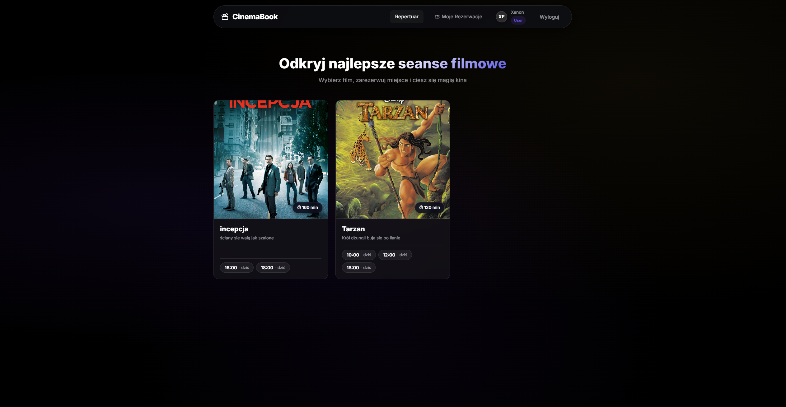
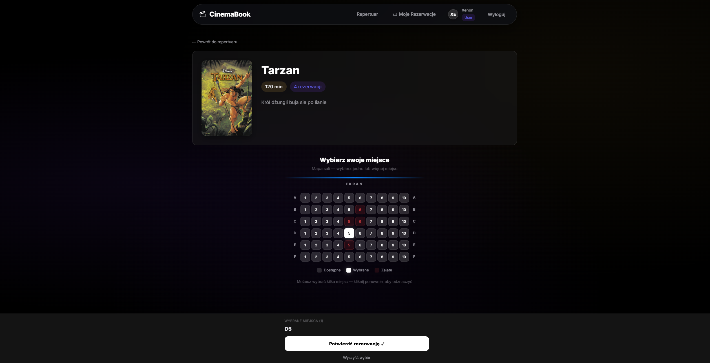
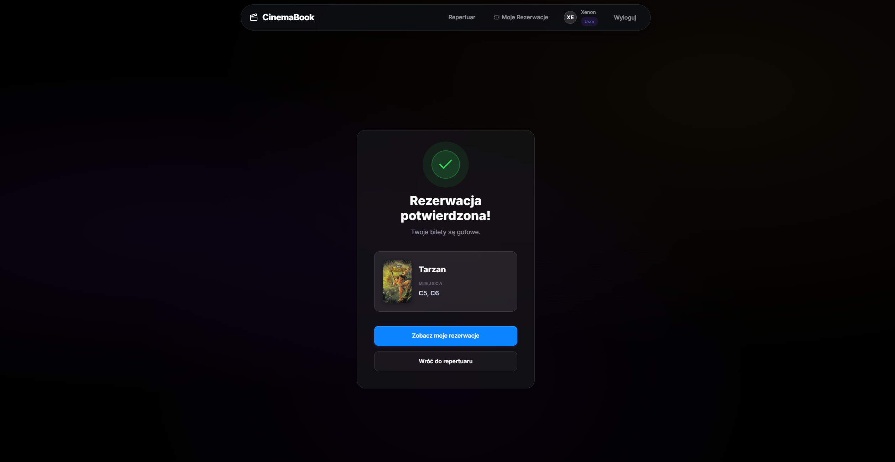
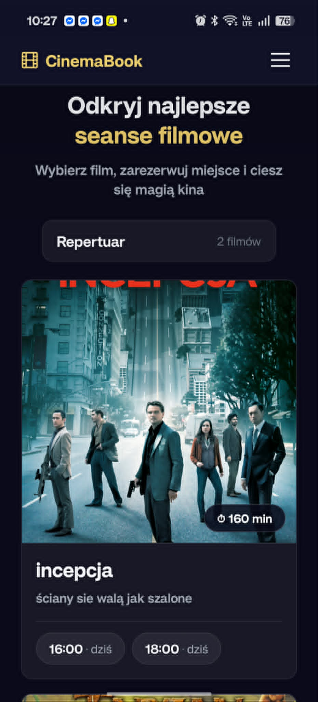
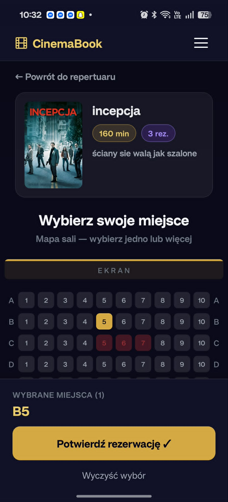
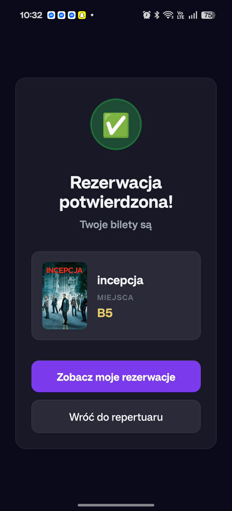

# CinemaBookingApp

Kompleksowy system rezerwacji biletów kinowych, składający się z wydajnego backendu w .NET oraz dwóch aplikacji klienckich: przeglądarkowej (Vue.js) i mobilnej (React Native). Projekt został zaprojektowany z naciskiem na elegancki interfejs klasy premium (w stylu "Netflix/Apple") – z wszechobecnym ciemnym motywem, elementami glassmorphism i wysokim kontrastem.

## 🏗️ Architektura Systemu

System opiera się na 3 głównych filarach:
1. **Backend API (.NET C#)**: Zaawansowane Web API realizujące pełną logikę biznesową, autoryzację JWT, zarządzanie salami i repertuarem, asynchroniczną wysyłkę e-maili i system rezerwacji biletów oparty na chmurze Microsoft Azure.
2. **Frontend Web (Vue.js)**: Responsywna wersja przeglądarkowa dla klientów oraz pełnoprawny panel administratora.
3. **Frontend Mobile (React Native)**: Natywna aplikacja mobilna oferująca najwyższy komfort rezerwacji biletów bezpośrednio ze smartfona.

---

## ☁️ Architektura Chmurowa i Backend (Microsoft Azure)

Aplikacja backendowa (C# .NET) została zaprojektowana zgodnie z dobrymi praktykami tworzenia skalowalnych systemów, wykorzystując szeroki wachlarz usług chmury **Microsoft Azure**:

- **Azure SQL Database (Replikacja)**: Główna relacyjna baza danych obsługująca repertuar, seanse, użytkowników i rezerwacje. Architektura uwzględnia replikację danych (odczyt/zapis) dla zwiększenia wydajności i niezawodności.
- **Azure Service Bus**: Zaawansowana kolejka komunikatów pozwalająca na całkowite zrównoleglenie procesów (np. kolejkowanie żądań wysłania e-maila po potwierdzeniu bądź odwołaniu rezerwacji), odciążająca główny wątek aplikacji.
- **Azure Cosmos DB**: Nierelacyjna baza dokumentowa (NoSQL) dedykowana do przechowywania systemu opinii i recenzji filmów (Reviews), zapewniająca błyskawiczny odczyt rozproszonych danych na całym świecie.
- **Azure Redis Cache**: Rozproszona pamięć podręczna wykorzystywana do drastycznego przyśpieszenia najczęściej odpytywanych endpointów i odciążania bazy SQL.
- **Azure Blob Storage**: Przestrzeń do przetrzymywania plików binarnych – miniatur, plakatów filmowych i mediów aplikacji, połączona z endpointami API.
- **Azure Worker Roles (Background Services)**: System zadań działających w tle w architekturze mikrousług/workerów (np. obsługa e-maili, cykliczne sprzątanie nieopłaconych rezerwacji), nasłuchujących komunikaty z Service Bus.
- **Azure Auto Scaling**: Konfiguracja w chmurze zapewniająca automatyczne skalowanie instancji (scale-out / scale-in) w zależności od nagłych przyrostów obciążenia, jak np. po premierze kasowego hitu kinowego.

---

## 💻 Aplikacja Webowa (Vue.js)

Katalog: `/frontend`

Aplikacja stworzona przy użyciu **Vue 3** oraz bundlera **Vite**. Zapewnia błyskawiczne działanie (Single Page Application) i kładzie potężny nacisk na odczucia wizualne użytkownika.

### Galeria Interfejsu (Web)


*Ekran główny i nowoczesny repertuar z efektem Glassmorphism*


*Interaktywny widok wyboru miejsc w sali kinowej*


*Dedykowany widok potwierdzenia zakupu biletów*

### Najważniejsze cechy:
- **Premium UX/UI**: Zaawansowany system projektowania z mocno zaokrąglonymi kształtami, pływającymi etykietami formularzy (Floating Labels znane z Material Design), płynnymi animacjami przejść oraz responsywnością.
- **Routing**: Obsługa spójnej nawigacji (Strona główna, Logowanie, Rejestracja, Panel Admina, Szczegóły Seansu, Moje Bilety, Dedykowany ekran Sukcesu Rezerwacji) poprzez `vue-router`.
- **Interaktywny Seat Picker**: W pełni responsywna, zintegrowana mapa sali kinowej. Animowane fotele dynamicznie komunikują stan (dostępne, zarezerwowane przez kogoś, wybrane) za pomocą kolorów z palety i podświetleń shadow.
- **Komunikacja API**: Szybka integracja ze wszystkimi końcówkami API poprzez skonfigurowaną instancję `axios`.

---

## 📱 Aplikacja Mobilna (React Native)

Katalog: `/mobile`

Natywna aplikacja na systemy iOS i Android zbudowana w środowisku **React Native** (z użyciem Expo). Umożliwia użytkownikom błyskawiczny dostęp do repertuaru i własnych biletów.

### Galeria Interfejsu (Mobile)

<div style="display: flex; gap: 10px; justify-content: center; flex-wrap: wrap;">
  <div style="text-align: center;">
    
    <br/><em>Repertuar filmów</em>
  </div>
  <div style="text-align: center;">
    
    <br/><em>Wybór miejsc</em>
  </div>
  <div style="text-align: center;">
    
    <br/><em>Potwierdzenie rezerwacji</em>
  </div>
</div>

### Najważniejsze cechy:
- **Natywna Płynność**: Animowane widoki i przejścia (np. wykorzystanie interfejsu `Animated` do płynnego, sprężystego wysuwania paska z potwierdzeniem wyboru miejsc z dołu ekranu).
- **Dotykowy UX**: Siatki (grid) filmów, powiększone wskaźniki nawigacyjne oraz czytelne karty rezerwacji dopasowane ergonomicznie do dotykowych ekranów.
- **Nawigacja i SafeArea**: Płynny system `react-navigation` z uwzględnieniem bezpiecznych stref ekranu, wycięć na aparat (notch) i odpowiedniego rozmieszczenia dolnych pasków (tab bars/footers).
- **Bezpieczeństwo**: Sesja użytkownika oparta o JWT jest obsługiwana lokalnie z użyciem Context API, zapewniając bezproblemowe logowanie bez narzutów.

---

## Uruchomienie lokalne

### 1. Backend (.NET)
```bash
# W głównym katalogu
dotnet run
```
Twoje API wystartuje lokalnie, umożliwiając obsługę zapytań z obu aplikacji.

### 2. Frontend (Vue.js)
```bash
cd frontend
npm install
npm run dev
```
Uruchomi błyskawiczny serwer deweloperski Vite z funkcją Hot-Module Replacement.

### 3. Aplikacja mobilna (React Native)
```bash
cd mobile
npm install
npm start
```
Uruchomi Metro Bundler, z którego możesz pobrać aplikację na symulator (iOS/Android) lub połączyć się ze swoim urządzeniem fizycznym za pomocą aplikacji Expo Go.

